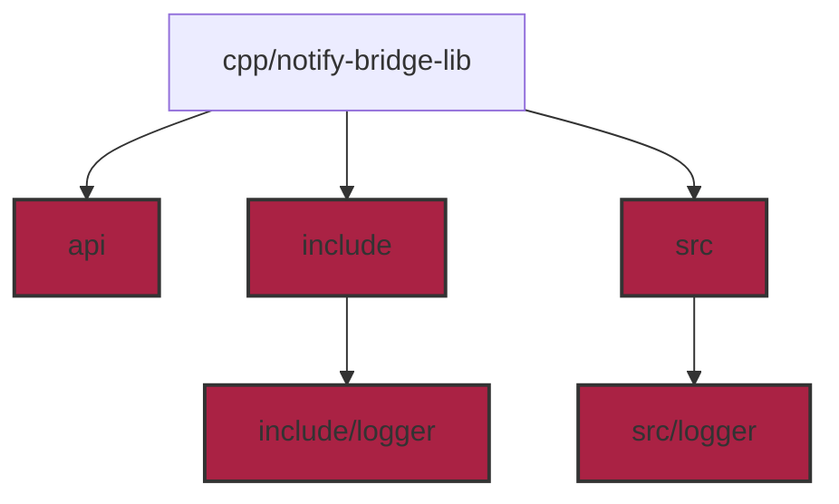

# cpp

C++ code to build the example.

## Architecture

### 1. Folder: **cpp/notify-bridge-lib/api**

Native API to be consumed by the clients: **NotifyBridgeApi.h**

### 2. Folder: **cpp/notify-bridge-lib/include**

Header files to build the example.

### 3. Folder: **cpp/notify-bridge-lib/include/logger**

Header files to build the example, relatives to logging native system.

### 4. Folder: **cpp/notify-bridge-lib/src**

Source files to build the example.

### 5. Folder: **cpp/notify-bridge-lib/src/logger**

Source files to build the example, relatives to logging native system.

## Architecture diagram.

