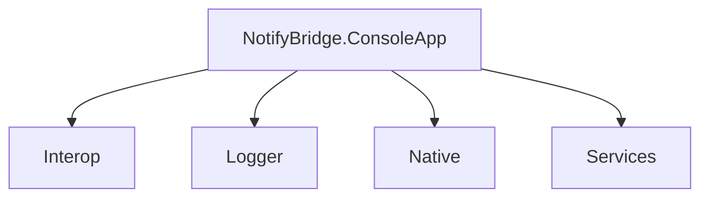

# NotifyBridge.ConsoleApp

## Project Overview

This project provides the structure for a .NET Console Application with support for logging, interop, and service-based architecture.

## Folder Structure

```plaintext
dotnet/NotifyBridge.ConsoleApp/
├── Interop
├── Logger
├── Native
├── Services
```

### Folder Descriptions

- **Interop**: Contains classes and interfaces for interoperation with external engines.
- **Logger**: Contains logging utilities, including custom logger implementations and extensions.
- **Native**: Includes native delegate definitions for low-level operations.
- **Services**: Defines service interfaces and implementations to manage the application's core logic.

## Mermaid Diagram



This diagram represents the high-level structure of the project, focusing on its main components.

